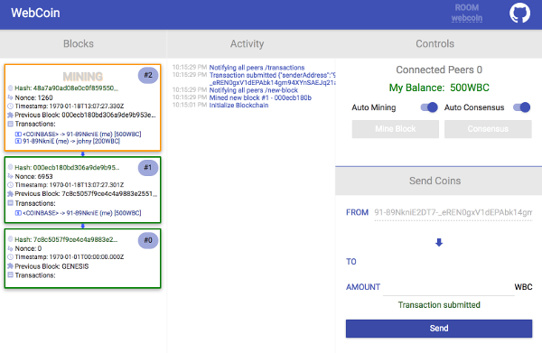

# WebCoin - The browser based blockchain

This repository was created as part of the how-to-build-your-own-blockchain contest as advertised
[here](https://github.com/blockchain-academy/how-build-your-own-blockchain/blob/master/CONTEST.md).

## TL;DR

A JS implementation of a simple in-browser blockchain with fancy UI - [check it out](https://mrbar42.github.io/how-build-your-own-blockchain/)

Highlights:
- Runs in Browser
- Networking based on [WebRTC](https://webrtc.org/)
- Self management - auto mining, auto consensus, announce blocks and transactions
- Web UI
- Cryptographic transactions signature and verification

## Content
- [Feature](#feature)
- [Web UI](#web-ui)
- [Technical Overview](#technical-overview)
- [Possible Next steps](#possible-next-steps)

## Feature
1. Replace networking stack with [WebRTC](https://webrtc.org/)
  1. nodes are connecting and messaging directly using WebRTC Data-Channels
  2. Shimmed express and fetch to keep the existing routes interface
2. Nodes discovery using a signaling server (provided by [simpleWebRTC](https://simplewebrtc.com/)).
   Once the node has discovered other nodes in the network it disconnects from the signaling server, and all the blockchain communication is done solely via WebRTC
3. Add auto mining, and consensus, and toggle between auto and manual modes
  1. In auto mode, mining is continuous and peers keep mining after discovering new blocks,
     they are advertising about new blocks they mined to the network, and run consensus resolving after being notified on new changes in the chain.
  2. In manual mode, the user manually calls to mine a single block, or to get updates from the network and solve the consensus.
4. Revamped transactions
  1. Automatic transaction broadcast to all peers
  2. Miners verify that a sender has enough balance
  3. Transaction are now being signed using ECDSA with [WebCrypto API](https://en.wikipedia.org/wiki/Web_cryptography_API)
  4. Miners verify that transaction is signed correctly by the sender
  5. Miners verify that transactions are singular in the chain (by comparing signatures)
  6. Miners maintain transaction pool, if the block reaches maximum size, they'll keep transactions for later blocks
5. WebUI - to make it more approachable for project newcomers, also we think it helps a lot with feeling and understanding what's going on.
6. Build using webpack, add sourcemaps to make the project more approachable to newcomers

## Web UI

it visualizes the blockchain and allows submitting transactions, controlling mining and consensus.
a live demo can be found [here](https://mrbar42.github.io/how-build-your-own-blockchain/)

What should you do with it?
- **Submit a transaction** - use the bottom right panel to submit a transaction to and address of your choice.
Be sure to mine some blocks to get some coins and to help building the incredible chain.
- **Control mining** - using the toggle switch on the top right corner you can disable auto mining and mine a block by yourself.
but remember you have to be quick! as other miners also try their luck - who will win the prestigious block mining reward?
the first to publish a valid next block.
- **Control consensus** - peers have to be in perfect sync. a consensus means that your peer compares
the blockchain of the other peers and its own and chooses the longest valid chain.
disabling auto consensus means that the local peer will not attempt to synchronize its chain with the other chains slowly
but surely drifting away from the network so be sure to call consensus to stay up to date!
- **Create you're own room** - use the query string to create an isolated room you can play with your chain buddies.
for example to create a room called `secret-coin-room` add this query string to the demo address `?room=secret-coin-room`

an important note: due to the way the browser works,
mining will be terribly slow when the tab is in the background, so keep it in the front.

## Technical Overview
 final.ts was separated to many smaller modules.

 Prominent modules:
 - `app.ts` - entry point to the project, initializes the app
 - `node-controller.ts` - the main node manager that manages mining and consensus
 - `blockchain.ts` - the core of the blockchain functionality and blocks storage
 - `simple-node.ts` - connects to other peers, and maintain a list of connected peers
 - `peer.ts` - represents a remote peer and allows two-way communication
 - `ui/main.js` - initializes the ui and connects it to the blockchain

Whenever a new block is mined or a transaction is submitted the peers communicate,
exchange information and verify the blocks/transactions.
The peers will choose the longest valid chain.

## Possible Next steps
1. Make transactions even more real - multiple input, output, and input should be previous transactions.
2. Add UTXO pool
3. Add smart contracting
4. Add local storage to keep user private key and wallet
5. When resolving a consensus from other chains, verify the transactions in the chain are valid.

